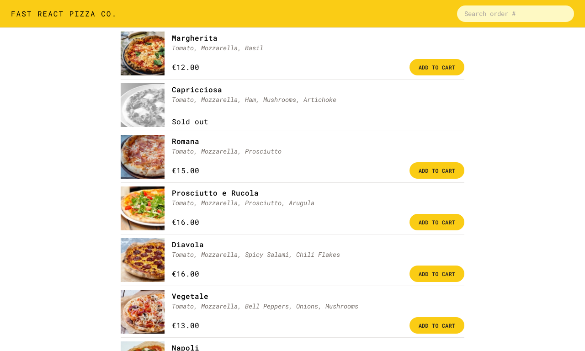

<div align="center">

# 🍕 Fast React Pizza Co.

### [**Live Demo**](https://fast-react-pizza-salem.vercel.app/)

[Report Bug](https://github.com/AbdelrahmanSalemQotb/Fast-React-Pizza/issues) • [Request Feature](https://github.com/AbdelrahmanSalemQotb/Fast-React-Pizza/pulls)

   <hr>

Fast React Pizza is a responsive web application that simulates a pizza ordering system. Built with React and modern web technologies, it provides a seamless user experience for browsing menus, placing orders, and tracking deliveries.



</div>

## ⚠️ Important Note

This is a simulation project:

- Uses mock API integration for demonstration purposes
- Orders are not actually processed
- All transactions are simulated

## 🎯 Features

- **Menu Browsing:** Browse through various pizza options and their details
- **Cart Management:** Add/remove items, adjust quantities
- **Order Tracking:** Real-time simulation of order status
- **Responsive Design:** Works seamlessly on mobile, tablet, and desktop
- **State Management:** Centralized state handling with Redux Toolkit
- **Modern UI:** Clean and intuitive interface with Tailwind CSS

## 🚀 Tech Stack

- ⚛️ React
- 🔄 Redux Toolkit
- 🛣️ React Router
- 🎨 Tailwind CSS
- ⚡ Vite
- 📱 Responsive Design

## 💻 Installation & Setup

1. Clone the repository

```bash
git clone https://github.com/AbdelrahmanSalemQotb/Fast-React-Pizza.git
```

2. Navigate to project directory

```bash
cd Fast-React-Pizza
```

3. Install dependencies

```bash
npm install
```

4. Start development server

```bash
npm run dev
```

5. Build for production

```bash
npm run build
```

## Author

### Abdelrahman Salem

<div align="center">

[](https://github.com/AbdelrahmanSalemQotb) [](https://www.linkedin.com/in/abdelrahman-salem-qotb)

</div>

## Acknowledgments

This project was completed as part of [Jonas Schmedtmann's](https://jonas.io/) - [javascript course](https://www.udemy.com/course/the-complete-javascript-course). The knowledge and skills gained from this excellent course were instrumental in building this application.
